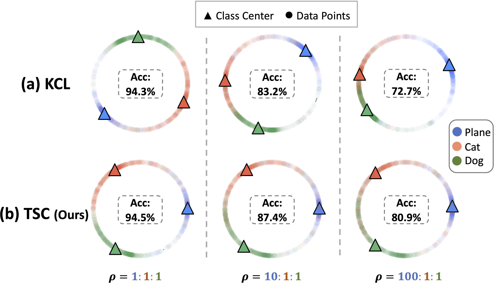

# Targeted Supervised Contrastive Learning for Long-Tailed Recognition

This repository contains the implementation code for paper: <br>
__Targeted Supervised Contrastive Learning for Long-Tailed Recognition__ <br>
[Tianhong Li*](http://tianhongli.me/), [Peng Cao*](https://people.csail.mit.edu/pengcao/), [Yuan Yuan](https://yyuanad.github.io/), [Lijie Fan](http://lijiefan.me/), [Yuzhe Yang](https://www.mit.edu/~yuzhe/), [Rogerio Feris](https://www.rogerioferis.org/), [Piotr Indyk](https://people.csail.mit.edu/indyk/), [Dina Katabi](https://people.csail.mit.edu/dina/) <br>
_IEEE / CVF Computer Vision and Pattern Recognition Conference (CVPR 2022)_ <br>
[[Paper](https://arxiv.org/abs/2111.13998)]


This repository also contains an unofficial reimplementation for paper: <br>
__Exploring Balanced Feature Spaces for Representation Learning__ <br>
Bingyi Kang, Yu Li, Sa Xie, Zehuan Yuan, Jiashi Feng <br>
_The Ninth International Conference on Learning Representations (ICLR 2021)_

If you find this code or idea useful, please consider citing our work:
```bib
@article{li2021targeted,
  title={Targeted Supervised Contrastive Learning for Long-Tailed Recognition},
  author={Li, Tianhong and Cao, Peng and Yuan, Yuan and Fan, Lijie and Yang, Yuzhe and Feris, Rogerio and Indyk, Piotr and Katabi, Dina},
  journal={arXiv preprint arXiv:2111.13998},
  year={2021}
}
```
___
<p align="center">
     <br>
<b> With high imbalance ratio, class centers learned by KCL exhibit poor uniformity while class centers learned by TSC are still uniformly distributed and thus TSC achieves better performance. </b>
</p>


## Preparation

#### Prerequisites
- Download [ImageNet](http://image-net.org/download) dataset, and place them in your `data_root`. Long-tailed version will be created using train/val splits (.txt files) in corresponding subfolders under `imagenet_inat/data/`
- Change the `data_root` and `save_folder` in [`main_moco_supcon_imba.py`](.main_moco_supcon_imba.py) and [`main_lincls_imba.py`](.main_lincls_imba.py) accordingly for ImageNet-LT.
- All trainings are tested on 4 Titan X GPUs.
#### Dependencies
- PyTorch (>= 1.6, tested on 1.6)
- scikit-learn
- tensorboard-logger

## Usage
Training of KCL/TSC cosists of two steps: first, the feature encoder (ResNet-50) is pretrained using KCL/TSC losses. Second, a linear classifier is added on top of the feature encoder and fine-tuned using cross-entropy loss.
### Target generation:
To generate targets for TSC pre-training, use 
```
python target_generation.py
```
The generated targets will be stored at optimal_{N}_{M}.npy, 
where N is the number of classes, M is the dimension of output features.


### 1st stage pre-training:
#### KCL
```bash
python main_moco_supcon_imba.py --cos --epochs 200 --K 6 --moco-dim 128 --mlp \                                                                                                         -a resnet50 --name kcl_release \
  -a resnet50 --name [YOUR PREFERRED NAME] \
  --lr 0.1 --batch-size 256 \
  --dist-url 'tcp://localhost:10000' --multiprocessing-distributed --world-size 1 --rank 0 \
  --dataset imagenet
```

#### TSC
```bash
python main_moco_supcon_imba.py --cos --epochs 400 --K 6 --moco-dim 128 --mlp --targeted --tr 1 --sep_t --tw 0.2 \
  -a resnet50 --name [YOUR PREFERRED NAME] \
  --lr 0.1 --batch-size 256 \
  --dist-url 'tcp://localhost:10000' --multiprocessing-distributed --world-size 1 --rank 0 \
  --dataset imagenet
```

### 2nd stage fine-tuning:
```bash
python main_lincls_imba.py  --dataset imagenet  --pretrained [PRETRAINED MODEL PATH FROM 1ST STAGE] --epochs 40 --schedule 20 30 --seed 0 -b 2048
```

## Results
Here we show the accuracy of KCL and TSC on ImageNet-LT in 5 trails:

| Method    | Trial 1 | Trial 2 | Trial 3 | Trial 4 | Trial 5 |
|-----------|:-------:|:-------:|:-------:|:-------:|:-------:|
| KCL       |  51.2   |  51.6   |  51.5   |  51.2   |  51.3   | 
| TSC       |  52.3   |  53.0   |  52.6   |  52.1   |  52.2   |

NOTE:
many/medium/minor classes accuracy could change significantly with different learning rate or batch size in the second stage while overall accuracy remains the same.

## Acknowledgement
This code inherits some codes from [MoCo](https://github.com/facebookresearch/moco) and [Classifier-Balancing](https://github.com/facebookresearch/classifier-balancing).

## Contact
If you have any questions, feel free to contact me through email (tianhong@mit.edu) or Github issues. Enjoy!